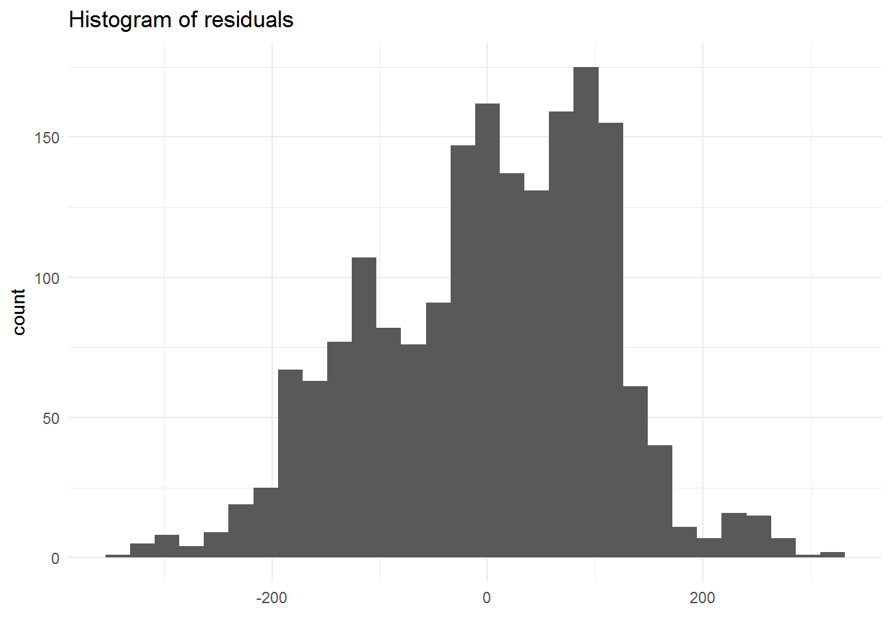
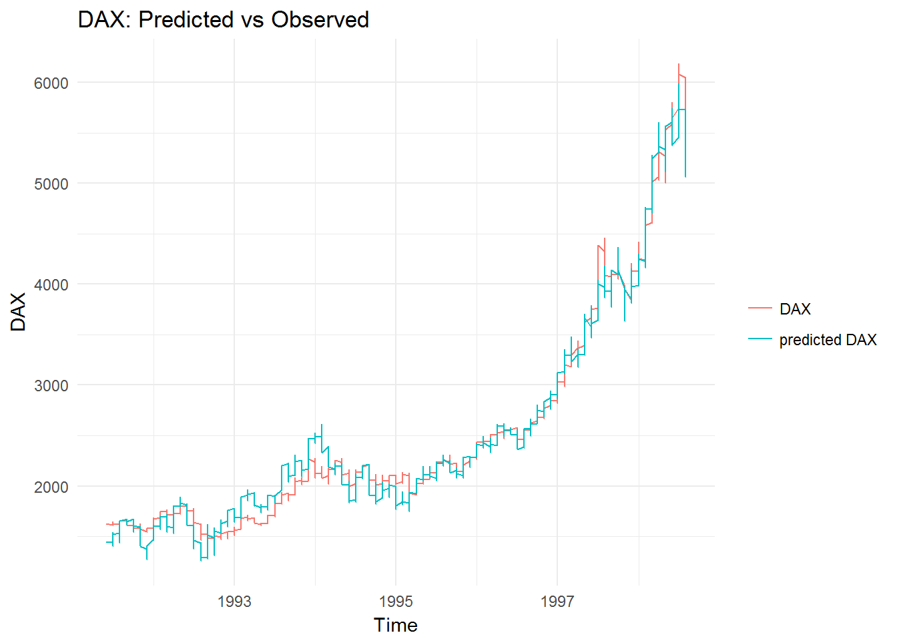

# README

The goal of functions in this repo is to semiautomatically build Ordinary Least Squares (OLS) models on the basis of a set of declared variables. If the available data are time series, lagging and differencing is possible.

## 1. Short description of the functions:
1. `ols`:         Function allows building one OLS model and performs statistical tests.
2. `ols_summary`: Function allows building multiple OLS models and lets the user parallelization of computations (if required).
3. `ncomb`:       Allows all possible combinations of a set of variables (including the ones after differencing).
4. `lags`:        Allows lagging variables.
5. `difs`:        Allows differencing variables.

## 2. Tutorial

This tutorial will teach you how to use above mentioned functions. After getting through below given examples, you'll be able to:

0. Required packages
1. Build one regression model and test it.
2. Visualize histogram of errors.
3. Difference and lag selected variables.
4. Build multiple regresssion models and test them.
5. Use parallelization while building multiple models.
6. Decide if utilizing parallelization actually shortens computation time.

### 2.0 Required packages

Before starting our tutorial, a few packages should be installed _a priori_:
```{r install.packages, eval = F}
install.packages("caret")
install.packages("lmtest")
install.packages("car")
install.packages("nortest")
install.packages("scales")
install.packages("strucchange")
install.packages("lubridate")
install.packages("nortest")
install.packages("microbenchmark")
```

### 2.1 Our first regression model

Firstly, let's read the data. We will take advantage of `EuStockMarkets` from library `datasets`:


```{r  results='hide', message=FALSE, warning=FALSE}
library(datasets)
data(EuStockMarkets)
```
```{r functions, echo=F, message=FALSE, warning=FALSE, include = F}
source('ols.R')
source('lags.R')
source('difs.R')
source('ncomb.R')
source('ols_summary.R')
```

Let's take a look at a couple of rows:

```{r, results='hide'}
head(EuStockMarkets)
```
```{r echo = F, results = 'asis'}
knitr::kable(head(EuStockMarkets))
```

The data set consists of 4 time series - stock indexes. In order to build our first OLS models, we can use the function `ols`:

```{r first_OLS_model}
model1 <- ols(dset = EuStockMarkets,
              target = "DAX",
              vars = "SMI CAC FTSE")
```
The first agrument, `dset`, is the data set we want to use. `target` is our target variable; `vars` is a string contaning variable names separated by single blanks (spaces). Let't take a look at names of consecutive elements of `model1`:

```{r first_model_ouput}
names(model1)
```

We can see that the object consists of 5 elements. We will start our analysis with the first one, `stats`:
```{r first_model_stats_show, results = 'hide'}
model1$stats
```
```{r echo = F, results = 'asis'}
knitr::kable(model1$stats)
```

The output presents a flat table, showing the target variable, the independent variables, statistics representing the model quality (R-Squared, adjusted R-Squared, RMSE) and some statistical tests:
1. __F__:       significance test of all variables in the model.
2. __bp__:      Breusch-Pagan heteroscedasticity test.
3. __bg__:      Breusch-Godfrey autocorrelation test.
4. __reset__:   RESET \specification test (informs whether the linear model can be applied for such target and independent variables).
5. __ad__:      Anderson-Darling normality of error term test.
6. __sw__:      Shapiro-Wilk normality of error term test (for small samples, n<20).
7. __chow__:    Chow test checking stability of coefficients in time.
8. __max.vif__: Maximum VIF (Variance Inflation Factor) in the model.
Additionally, the _tests_ column informs whether the model complies with tests from points 2-7. _n_ is the number of observations, on which the model was built. The last column shows the equation of a given regression.

The table `var.stats` show statistics of regressors:

```{r first_model_vars_stats_show, results = 'hide'}
model1$var.stats
```
```{r echo = F, results = 'asis'}
knitr::kable(model1$var.stats, row.names = F)
```

The consecutive columns shows variable names, their coefficients, p.values and VIFs. We can see that VIFs of `SMI` and `FTSE` are way beyond 10 (one of many literature threshold for this indicator). We will cope with this problem later.

The default p-value for the regression is `alpha = 0.05`. This parameter can also be changed:

```{r p.value}
model1 <- ols(dset = EuStockMarkets,
              target = "DAX",
              vars = "SMI CAC FTSE",
              alpha = 0.1)
model1["var.stats"]
```

As mentioned above, multicollinearity ws observed. In order to ged rid of it, we can exclude the `SMI` index from the model:

```{r second_model_vars_stats_show, results = 'hide'}
model2 <- ols(dset = EuStockMarkets,
                target = "DAX",
                vars = "CAC FTSE")
model2$var.stats
```
```{r echo = F, results = 'asis'}
knitr::kable(model2$var.stats, row.names = F)
```

# 2.2 Visualizations

We can output residuals of the regression by using the argument `output.residuals`:

```{r residuals}
model1 <- ols(dset = EuStockMarkets,
                target = "DAX",
                vars = "SMI CAC FTSE",
                visualize = T,
                output.residuals = T)
qplot(model1[["output.residuals"]]) +
  theme_minimal() +
  xlab('') +
  ggtitle("Histogram of residuals") # plot
```


The `EuStockMarkets` data set is an object of `mts` class. That means that it includes dates. We can take advantage of it and visualise predicted and observed values of `DAX ` on one plot dependent on time. To do it,`time.series` and `visualize` arguments are used:

```{r predicted_vs_observed_plot }
model1 <- ols(dset = EuStockMarkets,
              target = "DAX",
              vars = "CAC FTSE",
              time.series  = T,
              visualize = T)
model1$time.plot
```


## 2.3 Multiple regression models

Now we will proceed to building multiple models. At the moment objects of class `mts` are not handled, so at first our data set should be converted into a data frame. Then we can add some lagged variables. To lag regressors, we can use `lag` function:

```{r lag_vars1}
EuStockMarkets <- data.frame(EuStockMarkets)

EuStockMarkets <- lags(dset = EuStockMarkets,
     vars = c("SMI", "CAC", "FTSE"),
     lag.vec = 1:4)
```

`dset` is the data set, in which variables can be found. The argument`vars` selects variables, which should be lagged. `lag.vec` is a vector of lags which should be executed. In this case, there are four lags: the minimum lag is `1`, and  the maximum is `4`. Lagged variables have a sufix `.<lag.order.`, e.g. the `SME` index lagged by with a lag of three periods is called `SMI.3`.

Having lagged variables, we can proceed to obtaining vectors of all the possible combinations of lagged (and unlagged) regressors. To do this, we will use the function `ncomb`:

```{r combinations1}
vars <- ncomb(vec = c("SMI", "CAC", "FTSE"),
              m = 1,
              n = 3,
              max.lag = 4)
```
The vector `vec` indicates, which variables should be taken into consideration when making combinations. `m` is a minimum number in combination and `n` is maximum number of variables in combination. `max.lag` indicates maximum lag of variables, which should be used when making combinations.

Let's see the result of `ncomb`:
```{r combination1.results}
head(vars, 10)
tail(vars, 10)
```

and the number of produced combinations

```{r n.models}
n.models <- length(vars)
n.models
```
As we can see, in a moment we will build `r n.models` OLS models. To obtain them in one command, `ols_summary` function will be used:

```{r multiple_models1}
models <- ols_summary(dset.sum = EuStockMarkets,
                      target.sum = rep("DAX", n.models),
                      vars.sum = vars)
```

`dset.sum` is our converted data set, `target.sum` is target variable repeated `n.models` times (since we want to build such a number of regressions) and `vars.sum` is a vector of all combinations of regressors produced by `ncomb` function.

The resulst are of the same structure as in case of our first model (obtained from `ols` function). The only additional column we get is `model.num`, which is a model number:

```{r model_num}
models.stats <- models$stats
models.stats$model.num
```

Let's see six best models in terms of adjusted R-Squared:

```{r six_best, results = 'hide'}
head(models.stats[order(models.stats$adjusted.R2, decreasing = T),])
```
```{r echo = F, results = 'asis'}
knitr::kable(head(models.stats[order(models.stats$adjusted.R2, decreasing = T),]))
```

As it can be noticed, the best model was the 185th one. We can see it by looking it up in `vars.stats` list:

```{r multiple.vars.stats, , results = 'hide'}
vars.stats <- models$vars.stats
vars.stats[[185]]
```
```{r multiple.vars.stats, echo = F, results = 'asis'}
vars.stats <- models$vars.stats
knitr::kable(vars.stats[[185]])
```

What happens if a variable which is not in the data set is declared in`ols_summary`? Let's check it out:

```{r nonexistent_variables, error = T}
models <- ols_summary(dset.sum = EuStockMarkets,
                      target.sum = rep("DAX", n.models),
                      vars.sum = c("Nonexistent.Variable1",
                                   "Nonexistent.Variable2", vars))
```

## 2.5 Parallelization

We can parallelize our computations by using `do.parallel` argument. By default, the number of used cores is the `maximum.number.of.cores - 2`. This variable can be controlled by `n.cores`:

```{r parallel, eval = F}
models <- ols_summary(dset.sum = EuStockMarkets,
                      target.sum = rep("DAX", n.models),
                      vars.sum = vars,
                      do.parallel = T,
                      n.cores = 2)
```

Parallelization is turned off by default.

## 2.6 Benchmark of parallelized and non-parallelized computations

Do parallelized calculations actually execute faster than non-parallelized ones? In order to check it, the library `microbenchmark` was used, i.e. each function was ran 100 times:

```{r microbenchmark, results = 'hide', warning=FALSE, include = F}
library(microbenchmark)
set.seed(2017)
```
```{r microbenchmark1, eval = F}
mbm <- microbenchmark(
  "not.parallelized"  = {models <- ols_summary(dset.sum = EuStockMarkets,
                                               target.sum = rep("DAX", n.models),
                                               vars.sum = vars,
                                               do.parallel = F,
                                               progress.bar = F)},
  "parallelized" = {models <- ols_summary(dset.sum = EuStockMarkets,
                                          target.sum = rep("DAX", n.models),
                                          vars.sum = vars,
                                          do.parallel = T)})
```

```{r load_bechmark1, echo = F}
load("mbm_16cols_21012018.RData")
```

```{r, eval = F}
mbm
```

The table below presents statistic (mean, median etc.) of time required to execute a function (in seconds):

```{r microbenchmark1.results, echo = F}
knitr::kable(summary(mbm))
```

As it can be seen, the parallelization did not reduce calculation time. Such a result comes from time required to initialize a cluster, which takes a couple of seconds. If cacluations of ~200 regressions last a few seconds, employing additional cores does'nt make sense.

Will such a phenomenon hold for larger data? Let's find out by adding lags up to 16 and running the benchmark again (this time only 10 times due to the comuptations cost). In each iteration of each function, 5831 models will be build:

```{r microbenchmark2, eval = F}
vars2 <- ncomb(vec = c("SMI", "CAC", "FTSE"),
              m = 1,
              n = 3,
              max.lag = 16)
n.models2 <- length(vars2)

EuStockMarkets <- lags(dset = EuStockMarkets,
                       vars = c("SMI", "CAC", "FTSE"),
                       lag.vec = 1:16)

mbm2 <- microbenchmark(
  "not.parallelized"  = {models <- ols_summary(dset.sum = EuStockMarkets,
                                               target.sum = rep("DAX", n.models2),
                                               vars.sum = vars2,
                                               do.parallel = F,
                                               progress.bar = F)},
  "parallelized" = {models <- ols_summary(dset.sum = EuStockMarkets,
                                          target.sum = rep("DAX", n.models2),
                                          vars.sum = vars2,
                                          do.parallel = T)},
  times = 10)
mbm2
```

```{r load_bechmark2, echo = F}
load("mbm_52cols_21012018.RData")
```
```{r, eval = F}
mbm2
```
```{r microbenchmark2.results, echo = F}
knitr::kable(summary(mbm2))
```

In this case, parallelization shortened the time required to run a function call. It should be taken into consideration that the number of models was 27 times greater than previously.

As a rule of thumb, when dealing with a couple hundred of models, the computations should not be parallelized. When the number of models is at least a few thousands, additional cores can help.
