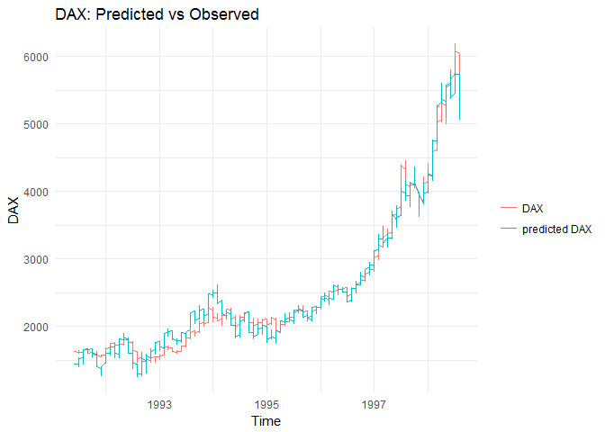

29 JAN 2018

README
======

The goal of functions in this repo is to semi automatically build Ordinary Least Squares (OLS) models on the basis of a set of declared variables. If the available data is time series, lagging and differencing is possible.

### 1. Short description of the functions

1.  `ols`: Function allows building one OLS model and performs statistical tests.
2.  `ols_summary`: Function allows building multiple OLS models and lets the user parallelization of computations (if required).
3.  `ncomb`: Allows all possible combinations of a set of variables (including the ones after differencing).
4.  `lags`: Allows lagging variables.
5.  `difs`: Allows differencing variables.
6.  `PRESS`: Computes PRESS statistic required to calculate predicted R-squared.
7.  `pred_r_squared`:Computes predicted R-squared.

### 2. Tutorial

This tutorial will teach you how to use above mentioned functions. After getting through below given examples, you'll be able to:

1.  Build one regression model and test it.
2.  Visualize histogram of errors.
3.  Obtaining additional statistic: predicted R-squared.
4.  Difference and lag selected variables.
5.  Build multiple regression models and test them.
6.  Use parallelization while building multiple models.
7.  Decide if utilizing parallelization actually shortens computation time.

### 2.0 Required packages

Before starting our tutorial, a few packages should be installed *a priori*:

``` r
install.packages("caret")
install.packages("lmtest")
install.packages("car")
install.packages("nortest")
install.packages("scales")
install.packages("strucchange")
install.packages("zoo")
install.packages("lubridate")
install.packages("nortest")
install.packages("microbenchmark")
install.packages("RcppEigen")
```

### 2.1 Our first regression model

Firstly, let's read the data. We will take advantage of `EuStockMarkets` from library `datasets`:

``` r
library(datasets)
library(RcppEigen)
data(EuStockMarkets)
```

Let's take a look at a couple of rows:

``` r
head(EuStockMarkets)
```

|      DAX|     SMI|     CAC|    FTSE|
|--------:|-------:|-------:|-------:|
|  1628.75|  1678.1|  1772.8|  2443.6|
|  1613.63|  1688.5|  1750.5|  2460.2|
|  1606.51|  1678.6|  1718.0|  2448.2|
|  1621.04|  1684.1|  1708.1|  2470.4|
|  1618.16|  1686.6|  1723.1|  2484.7|
|  1610.61|  1671.6|  1714.3|  2466.8|

The data set consists of 4 time series - stock indexes. In order to build our first OLS models, we can use the function `ols`:

``` r
model1 <- ols(dset = EuStockMarkets,
              target = "DAX",
              vars = "SMI CAC FTSE")
```

The first argument, `dset`, is the data set we want to use. `target` is our target variable; `vars` is a string containing variable names separated by single blanks (spaces). Let’s take a look at names of consecutive elements of `model1`:

``` r
names(model1)
```

    ## [1] "stats"            "var.stats"        "plot"            
    ## [4] "output.residuals" "time.plot"

We can see that the object consists of 5 elements. We will start our analysis with the first one, `stats`:

``` r
model1$stats
```

| target | vars         |         R2|  adjusted.R2|      RMSE|       AIC|       BIC|    F.stat|  F.p.value|  bp.stat|  bp.p.value|   bg.stat|  bg.p.value|  reset.stat|  reset.p.value|   ad.stat|  ad.p.value|    sw.stat|  sw.p.value|  chow.stat|  chow.p.value| significance |  max.p.value|   max.vif| tests |     n| equation                                                                                                  |
|:-------|:-------------|----------:|------------:|---------:|---------:|---------:|---------:|----------:|--------:|-----------:|---------:|-----------:|-----------:|--------------:|---------:|-----------:|----------:|-----------:|----------:|-------------:|:-------------|------------:|---------:|:------|-----:|:----------------------------------------------------------------------------------------------------------|
| DAX    | SMI CAC FTSE |  0.9898478|    0.9898314|  803.3033|  22749.55|  22777.19|  60320.47|          0|  243.397|           0|  1803.221|           0|    47.01741|              0|  10.44616|           0|  0.9862875|           0|   144.7465|             0| TRUE         |    0.4103735|  100.8572| TRUE  |  1860| (Intercept)*(-175.945668313583)+SMI*(0.49277225460085)+CAC*(0.495653787472762)+FTSE*(-0.0172026329222922) |

The output presents a flat table, showing the target variable, the independent variables, statistics representing the model quality (R-Squared, adjusted R-Squared, RMSE) and some statistical tests:

1.  **AIC**: Akaike Information Criterion comparable between different models; the smaller the AIC, the better the fit.
2.  **BIC**: Schwarz's Bayesian Criterion comparable between different models; the smaller the AIC, the better the fit. BIC is more restrictive than AIC: it penalizes more heavily models with greater number of parameters.
3.  **F**: significance test of all variables in the model.
4.  **bp**: Breusch-Pagan heteroscedasticity test.
5.  **bg**: Breusch-Godfrey autocorrelation test.
6.  **reset**: RESET specification test (informs whether the linear model can be applied for such target and independent variables).
7.  **ad**: Anderson-Darling normality of error term test.
8.  **sw**: Shapiro-Wilk normality of error term test (for small samples, n&lt;20).
9.  **chow**: Chow test checking stability of coefficients in time.
10. **max.vif**: Maximum VIF (Variance Inflation Factor) in the model.
11. **significance**: point out whether all variable in a model are statistically significant at determined level (by default: 5%).
12. **max.p.value**: shows the p.value of *the least significant* variable. 11. 11. **tests**: column informs whether the model complies with tests from points 2-7.
13. **n**: number of observations, on which the model was built. The last column shows the equation of a given regression.

Last but not least, the column **equation** presents model equation.

The table `var.stats` show statistics of regressors:

``` r
model1$var.stats
```

| var         |          coef|    p.value|        vif|
|:------------|-------------:|----------:|----------:|
| (Intercept) |  -175.9456683|  0.0000848|         NA|
| SMI         |     0.4927723|  0.0000000|  100.85721|
| CAC         |     0.4956538|  0.0000000|   12.47012|
| FTSE        |    -0.0172026|  0.4103735|   64.68514|

The consecutive columns shows variable names, their coefficients, p.values and VIFs. We can see that VIFs of `SMI` and `FTSE` are way beyond 10 (one of many literature threshold for this indicator). We will cope with this problem later.

The default p-value for the regression is `alpha = 0.05`. This parameter can also be changed:

``` r
model1 <- ols(dset = EuStockMarkets,
              target = "DAX",
              vars = "SMI CAC FTSE",
              alpha = 0.1)
model1["var.stats"]
```

    ## $var.stats
    ##                     var          coef       p.value       vif
    ## (Intercept) (Intercept) -175.94566831  8.479065e-05        NA
    ## SMI                 SMI    0.49277225 9.020895e-181 100.85721
    ## CAC                 CAC    0.49565379 2.999041e-180  12.47012
    ## FTSE               FTSE   -0.01720263  4.103735e-01  64.68514

As mentioned above, multicollinearity was observed. In order to get rid of it, we can exclude the `SMI` index from the model:

``` r
model2 <- ols(dset = EuStockMarkets,
                target = "DAX",
                vars = "CAC FTSE")
model2$var.stats
```

| var         |           coef|  p.value|       vif|
|:------------|--------------:|--------:|---------:|
| (Intercept) |  -1575.3045205|        0|        NA|
| CAC         |      0.8479211|        0|  6.194059|
| FTSE        |      0.6217500|        0|  6.194059|

It is also possible to build a model without an intercept. Such an action is controlled by the parameter `intercept`:

``` r
model3 <- ols(dset = EuStockMarkets,
              target = "DAX",
              vars = "CAC FTSE",
              intercept = FALSE)
```

    ## Warning in vif.default(model.original): No intercept: vifs may not be
    ## sensible.

``` r
model3$var.stats
```

| target | vars     |         R2|  adjusted.R2|      RMSE|       AIC|       BIC|    F.stat|  F.p.value|   bg.stat|  bg.p.value|  reset.stat|  reset.p.value|   ad.stat|  ad.p.value|    sw.stat|  sw.p.value|  chow.stat|  chow.p.value| significance |  max.p.value|   max.vif| tests |     n| equation                                         |
|:-------|:---------|----------:|------------:|---------:|---------:|---------:|---------:|----------:|---------:|-----------:|-----------:|--------------:|---------:|-----------:|----------:|-----------:|----------:|-------------:|:-------------|------------:|---------:|:------|-----:|:-------------------------------------------------|
| DAX    | CAC FTSE |  0.9769045|    0.9768796|  670.5558|  27740.15|  27756.73|  39295.28|          0|  1854.851|           0|    8859.123|              0|  138.9562|           0|  0.7871347|           0|   3803.564|             0| TRUE         |            0|  88.15412| TRUE  |  1860| CAC*(0.321755922999695)+FTSE*(0.536557076690009) |

| var  |       coef|  p.value|       vif|
|:-----|----------:|--------:|---------:|
| CAC  |  0.3217559|        0|  88.15412|
| FTSE |  0.5365571|        0|  88.15412|

In such case Breusch-Pagan test won't be executed (it requires an intercept).

### 2.2 Visualizations

We can output residuals of the regression by using the argument `output.residuals`:

``` r
model1 <- ols(dset = EuStockMarkets,
                target = "DAX",
                vars = "SMI CAC FTSE",
                visualize = TRUE,
                output.residuals = TRUE)
qplot(model1[["output.residuals"]]) +
  theme_minimal() +
  xlab('') +
  ggtitle("Histogram of residuals") # plot
```

    ## `stat_bin()` using `bins = 30`. Pick better value with `binwidth`.


The `EuStockMarkets` data set is an object of `mts` class. That means that it includes dates. We can take advantage of it and visualize predicted and observed values of `DAX` on one plot dependent on time. To do it,`time.series` and `visualize` arguments are used:

``` r
model1 <- ols(dset = EuStockMarkets,
              target = "DAX",
              vars = "CAC FTSE",
              visualize = TRUE,
              time.series  = TRUE)
model1$time.plot
```

    ## Don't know how to automatically pick scale for object of type yearmon. Defaulting to continuous.



However, data usually comes in the form of data frames. In such case, `time.plot` can be produced as well by pointing out the time variable in the data set. Exemplyfing, we will obtain the time variable from `EuStockMarkets`,transform it to a data frame and add the extracted time:

``` r
library(zoo)
date <- as.yearmon(time(EuStockMarkets))
EuStockMarkets <- data.frame(EuStockMarkets)
EuStockMarkets$date <- date
```

Now, let's build our model again, this time with calling the `time.var` argument and setting its value to previously obtained `date`:

``` r
model1 <- ols(dset = EuStockMarkets,
              target = "DAX",
              vars = "CAC FTSE",
              visualize = TRUE,
              time.var  = "date")
model1$time.plot
```

    ## Don't know how to automatically pick scale for object of type yearmon. Defaulting to continuous.

 We can see that the plots are identical.

Last but not least, it is possible to plot predicted and observed value even for . The object is produced by `ols` when `visualize` is set to `TRUE` and is simply called `plot`. This time we will use `iris` data set:

``` r
model2 <- ols(dset = iris,
              target = "Sepal.Length",
              vars = "Sepal.Width Petal.Length",
              visualize = TRUE)
model2$plot
```


### 2.3 Additional statistic: predicted R-squared

An additional statistic which can be optionally obtained is a predicted R-squared. It helps evaluating how well the model predicts new observations. The higher predicted R-squared, the better your model is at predictng new instances of the target variable. The method of its calculation is as follows:

1.  For every sample in the data set perform a Leave-One-Out Cross-Validation (LOOCV):

-   Predict the left out in a given run target value on the basis of the model built without this value.

1.  Compute the sum of squared differences between predicted and observed values obtained in .): it is so called `PRESS` statistic.
2.  Compute the ratio: `PRESS/TSS` (`TSS` = Tota Sum of Squared, i.e. the sum of squared differences between the target values and their average).
3.  Compute predicted R-squared: `1 - PRESS/TSS`.

If you're interested in more details, they can be found [here](https://rpubs.com/RatherBit/102428).

Let's not jump to the example. Again, we will use the `EuStockMarkets` data set. It is worth mentioning that for the needs of calculation of this statistic the **data set have to be a data frame** (not a `mts` object). However, in this example we don't have to worry about that since we transformed it earlier. The parameter controlling the output of this statistic is called `pred.R2`:

``` r
model4 <-ols(dset = EuStockMarkets,
              target = "DAX",
              vars = "CAC FTSE",
              pred.R2 = TRUE)
model4$stats
```

| target | vars     |         R2|  adjusted.R2|      RMSE|    pred.R2|      AIC|       BIC|    F.stat|  F.p.value|   bp.stat|  bp.p.value|   bg.stat|  bg.p.value|  reset.stat|  reset.p.value|   ad.stat|  ad.p.value|    sw.stat|  sw.p.value|  chow.stat|  chow.p.value| significance |  max.p.value|   max.vif| tests |     n| equation                                                                          |
|:-------|:---------|----------:|------------:|---------:|----------:|--------:|---------:|---------:|----------:|---------:|-----------:|---------:|-----------:|-----------:|--------------:|---------:|-----------:|----------:|-----------:|----------:|-------------:|:-------------|------------:|---------:|:------|-----:|:----------------------------------------------------------------------------------|
| DAX    | CAC FTSE |  0.9841894|    0.9841724|  708.3813|  0.9841277|  23571.5|  23593.62|  57798.07|          0|  301.2286|           0|  1802.022|           0|    146.4167|              0|  4.530819|           0|  0.9935889|       3e-07|   256.8144|             0| TRUE         |            0|  6.194059| TRUE  |  1860| (Intercept)*(-1575.30452045062)+CAC*(0.847921086750325)+FTSE\*(0.621750000476402) |

As we can see, the predicted R-squared is lower then both R-squared and adjusted R-squared.

Calculation of the predicted R-squared is turned off by default since it's really time consuming. Performing LOOCV translates to computing additional `n` models (where `n` is the number of observations in your data set). In the example above it was 1860 additional OLS models. Let's check how it influences computation time We will use the `microbenchmark` library. Each function was ran 100 times and on the basis of the results, basis statistics were obtained.

``` r
library(microbenchmark)

mbm.pred.R2 <- microbenchmark(
  "pred.R2"  = {model1 <- ols(dset = EuStockMarkets,
                                        target = "DAX",
                                        vars = "SMI CAC FTSE",
                                        pred.R2 = TRUE)},
  "no.pred.R2" = {model1 <- ols(dset = EuStockMarkets,
                                          target = "DAX",
                                          vars = "SMI CAC FTSE",
                                          pred.R2 = FALSE)})
mbm.pred.R2
```

| expr       |         min|          lq|        mean|      median|          uq|        max|  neval|
|:-----------|-----------:|-----------:|-----------:|-----------:|-----------:|----------:|------:|
| pred.R2    |  4671.14071|  4875.92802|  5141.06066|  5069.80760|  5291.08432|  6752.8239|    100|
| no.pred.R2 |    43.77589|    45.09869|    49.16099|    47.61333|    50.61435|    87.3956|    100|

As we can see, the computation time rockets on average by 104.576016 times from 0.049161 to 0.049161 seconds!

### 2.4 Differencing and lagging variables

Now we will proceed to building multiple models. At the moment objects of class `mts` are not handled, so at first our data set should be converted into a data frame (if it hasn't been done earlier). Then we can add some lagged variables. To lag regressors, we can use `lag` function:

``` r
EuStockMarkets <- data.frame(EuStockMarkets)

EuStockMarkets <- lags(dset = EuStockMarkets,
     vars = c("SMI", "CAC", "FTSE"),
     lag.vec = 1:4)
```

`dset` is the data set, in which variables can be found. The argument`vars` selects variables, which should be lagged. `lag.vec` is a vector of lags which should be executed. In this case, there are four lags: the minimum lag is `1`, and the maximum is `4`. Lagged variables have a suffix `.<lag.order.`, e.g. the `SME` index lagged by with a lag of three periods is called `SMI.3`.

Having lagged variables, we can proceed to obtaining vectors of all the possible combinations of lagged (and unlagged) regressors. To do this, we will use the function `ncomb`:

``` r
vars <- ncomb(vec = c("SMI", "CAC", "FTSE"),
              m = 1,
              n = 3,
              max.lag = 4)
```

The vector `vec` indicates, which variables should be taken into consideration when making combinations. `m` is a minimum number in combination and `n` is maximum number of variables in combination. `max.lag` indicates maximum lag of variables, which should be used when making combinations.

Let's see the result of `ncomb`:

``` r
head(vars, 10)
```

    ##  [1] "SMI.1" "SMI.2" "SMI.3" "SMI.4" "SMI"   "CAC.1" "CAC.2" "CAC.3"
    ##  [9] "CAC.4" "CAC"

``` r
tail(vars, 10)
```

    ##  [1] "SMI.1 CAC.4 FTSE" "SMI.2 CAC.4 FTSE" "SMI.3 CAC.4 FTSE"
    ##  [4] "SMI.4 CAC.4 FTSE" "SMI CAC.4 FTSE"   "SMI.1 CAC FTSE"  
    ##  [7] "SMI.2 CAC FTSE"   "SMI.3 CAC FTSE"   "SMI.4 CAC FTSE"  
    ## [10] "SMI CAC FTSE"

and the number of produced combinations

``` r
n.models <- length(vars)
n.models
```

    ## [1] 215

### 2.5 Creating multiple regression models

As we can see, in a moment we will build 215 OLS models. To obtain them in one command, `ols_summary` function will be used:

``` r
models <- ols_summary(dset.sum = EuStockMarkets,
                      target.sum = rep("DAX", n.models),
                      vars.sum = vars)
```

`dset.sum` is our converted data set, `target.sum` is target variable repeated `n.models` times (since we want to build such a number of regressions) and `vars.sum` is a vector of all combinations of regressors produced by `ncomb` function.

The results are of the same structure as in case of our first model (obtained from `ols` function). The only additional column we get is `model.num`, which is a model number:

``` r
models.stats <- models$stats
models.stats$model.num
```

    ##   [1]   1   2   3   4   5   6   7   8   9  10  11  12  13  14  15  16  17
    ##  [18]  18  19  20  21  22  23  24  25  26  27  28  29  30  31  32  33  34
    ##  [35]  35  36  37  38  39  40  41  42  43  44  45  46  47  48  49  50  51
    ##  [52]  52  53  54  55  56  57  58  59  60  61  62  63  64  65  66  67  68
    ##  [69]  69  70  71  72  73  74  75  76  77  78  79  80  81  82  83  84  85
    ##  [86]  86  87  88  89  90  91  92  93  94  95  96  97  98  99 100 101 102
    ## [103] 103 104 105 106 107 108 109 110 111 112 113 114 115 116 117 118 119
    ## [120] 120 121 122 123 124 125 126 127 128 129 130 131 132 133 134 135 136
    ## [137] 137 138 139 140 141 142 143 144 145 146 147 148 149 150 151 152 153
    ## [154] 154 155 156 157 158 159 160 161 162 163 164 165 166 167 168 169 170
    ## [171] 171 172 173 174 175 176 177 178 179 180 181 182 183 184 185 186 187
    ## [188] 188 189 190 191 192 193 194 195 196 197 198 199 200 201 202 203 204
    ## [205] 205 206 207 208 209 210 211 212 213 214 215

Let's see six best models in terms of adjusted R-Squared:

``` r
head(models.stats[order(models.stats$adjusted.R2, decreasing = T),])
```

|     | target | vars             |         R2|  adjusted.R2|      RMSE|   pred.R2|       AIC|       BIC|  F.stat|  F.p.value|  bp.stat|  bp.p.value|  bg.stat|  bg.p.value|  reset.stat|  reset.p.value|  ad.stat|  ad.p.value|  sw.stat|  sw.p.value|  chow.stat| chow.p.value |  significance|  max.p.value| max.vif |  tests| n                                                                                                              | equation |  model.num|
|-----|:-------|:-----------------|----------:|------------:|---------:|---------:|---------:|---------:|-------:|----------:|--------:|-----------:|--------:|-----------:|-----------:|--------------:|--------:|-----------:|--------:|-----------:|----------:|:-------------|-------------:|------------:|:--------|------:|:---------------------------------------------------------------------------------------------------------------|:---------|----------:|
| 185 | DAX    | SMI CAC.4 FTSE.4 |  0.9899472|    0.9899309|  803.4522|  22683.54|  22711.17|  60791.90|       0|   204.6968|        0|    1761.647|        0|    45.56233|           0|      10.304760|        0|   0.9867456|        0|    134.6473|          0| TRUE         |     0.0348734|    85.364357| TRUE    |   1856| (Intercept)*(-127.626973618169)+SMI*(0.513114108395759)+CAC.4*(0.482952957049387)+FTSE.4*(-0.0416017513798577) | DAX      |        185|
| 160 | DAX    | SMI CAC.4 FTSE.3 |  0.9899393|    0.9899230|  803.9688|  22684.99|  22712.62|  60743.76|       0|   206.9403|        0|    1758.698|        0|    47.30768|           0|      10.094337|        0|   0.9869969|        0|    133.6170|          0| TRUE         |     0.0832867|    89.611317| TRUE    |   1856| (Intercept)*(-140.068438037302)+SMI*(0.50873290702042)+CAC.4*(0.484290355238345)+FTSE.3*(-0.034770345076648)   | DAX      |        160|
| 135 | DAX    | SMI CAC.4 FTSE.2 |  0.9899310|    0.9899147|  804.4874|  22686.53|  22714.16|  60693.01|       0|   209.3146|        0|    1758.335|        0|    49.77853|           0|       9.865628|        0|   0.9872799|        0|    133.0109|          0| TRUE         |     0.2257422|    94.180270| TRUE    |   1856| (Intercept)*(-158.998174628224)+SMI*(0.502095876874254)+CAC.4*(0.486880719902912)+FTSE.2*(-0.0247679406452226) | DAX      |        135|
| 35  | DAX    | SMI CAC.4        |  0.9899230|    0.9899121|  700.2205|  22686.00|  22708.10|  91015.77|       0|   211.9794|        0|    1755.853|        0|    45.51831|           0|       9.365358|        0|   0.9878405|        0|    170.6485|          0| TRUE         |     0.0000000|     9.181714| TRUE    |   1856| (Intercept)*(-207.684673377669)+SMI*(0.485097308509324)+CAC.4\*(0.494904389563161)                             | DAX      |         35|
| 110 | DAX    | SMI CAC.4 FTSE.1 |  0.9899247|    0.9899083|  804.9980|  22687.70|  22715.33|  60654.42|       0|   211.9374|        0|    1757.695|        0|    53.06066|           0|       9.579326|        0|   0.9876018|        0|    133.3751|          0| TRUE         |     0.5827608|    98.990796| TRUE    |   1856| (Intercept)*(-184.955738670181)+SMI*(0.493022354676854)+CAC.4*(0.490983988133413)+FTSE.1*(-0.0114386271974997) | DAX      |        110|
| 210 | DAX    | SMI CAC.4 FTSE   |  0.9899234|    0.9899070|  805.5190|  22687.94|  22715.57|  60646.48|       0|   214.9618|        0|    1755.931|        0|    57.17214|           0|       9.268893|        0|   0.9879479|        0|    134.8465|          0| TRUE         |     0.8036974|   103.232524| TRUE    |   1856| (Intercept)*(-218.221847587644)+SMI*(0.481427677619494)+CAC.4*(0.496796260977783)+FTSE*(0.00525002049348799)   | DAX      |        210|

As it can be noticed, the best model was the 185th one. We can see it by looking it up in `vars.stats` list:

``` r
vars.stats <- models$vars.stats
vars.stats[[185]]
```

|             | var         |          coef|    p.value|       vif|
|-------------|:------------|-------------:|----------:|---------:|
| (Intercept) | (Intercept) |  -127.6269736|  0.0019513|        NA|
| SMI         | SMI         |     0.5131141|  0.0000000|  85.36436|
| CAC.4       | CAC.4       |     0.4829530|  0.0000000|  10.84197|
| FTSE.4      | FTSE.4      |    -0.0416018|  0.0348734|  57.61019|

What happens if a variable which is not in the data set is declared in `ols_summary`? Let's check it out:

``` r
models <- ols_summary(dset.sum = EuStockMarkets,
                      target.sum = rep("DAX", n.models),
                      vars.sum = c("Nonexistent.Variable1",
                                   "Nonexistent.Variable2", vars))
```

    ## Error in ols_summary(dset.sum = EuStockMarkets, target.sum = rep("DAX", : Variable(s):
    ##  Nonexistent.Variable1, Nonexistent.Variable2
    ##  is/are not in the data set.

### 2.6 Parallelization

We can parallelize our computations by using `do.parallel` argument. By default, the number of used cores is the `maximum.number.of.cores - 2`. This variable can be controlled by `n.cores`:

``` r
models <- ols_summary(dset.sum = EuStockMarkets,
                      target.sum = rep("DAX", n.models),
                      vars.sum = vars,
                      do.parallel = TRUE,
                      n.cores = 2)
```

Parallelization is turned off by default.

### 2.7 Benchmark of parallelized and non-parallelized computations

Do parallelized calculations actually execute faster than non-parallelized ones? In order to check it, the library `microbenchmark` was once again used. The comparison includes running the same calculations on one, two and three cores:

``` r
mbm <- microbenchmark(
  "not.parallelized"  = {models <- ols_summary(dset.sum = EuStockMarkets,
                                               target.sum = rep("DAX", n.models),
                                               vars.sum = vars,
                                               do.parallel = FALSE,
                                               progress.bar = FALSE)},
  "parallelized.2.cores" = {models <- ols_summary(dset.sum = EuStockMarkets,
                                          target.sum = rep("DAX", n.models),
                                          vars.sum = vars,
                                          do.parallel = TRUE,
                                          n.cores = 2)},
  "parallelized.3.cores" = {models <- ols_summary(dset.sum = EuStockMarkets,
                                                  target.sum = rep("DAX", n.models),
                                                  vars.sum = vars,
                                                  do.parallel = TRUE,
                                                  n.cores = 3)})
```

``` r
mbm
```

The table below presents statistic (mean, median etc.) of time required to execute a function (in seconds):

| expr                 |        min|         lq|       mean|     median|         uq|       max|  neval|
|:---------------------|----------:|----------:|----------:|----------:|----------:|---------:|------:|
| not.parallelized     |   9.054509|   9.138603|   9.375295|   9.187071|   9.464257|  14.57375|    100|
| parallelized.2.cores |  10.233477|  10.374942|  10.763843|  10.511067|  11.053782|  12.77917|    100|
| parallelized.3.cores |  10.872229|  11.059795|  11.316901|  11.139311|  11.471231|  17.23292|    100|

As it can be seen, the parallelization did not reduce calculation time. Such a result comes from time required to initialize a cluster, which takes a couple of seconds. If calculations of ~200 regressions last a few seconds, employing additional cores doesn’t make sense.

Will such a phenomenon hold for larger data? Let's find out by adding lags up to 16 and running the benchmark again (this time only 30 times due to the computations cost). In each iteration of each function, 5831 models will be build:

``` r
vars2 <- ncomb(vec = c("SMI", "CAC", "FTSE"),
              m = 1,
              n = 3,
              max.lag = 16)
n.models2 <- length(vars2)

EuStockMarkets <- lags(dset = EuStockMarkets,
                       vars = c("SMI", "CAC", "FTSE"),
                       lag.vec = 1:16)

mbm2 <- microbenchmark(
  "not.parallelized"  = {models <- ols_summary(dset.sum = EuStockMarkets,
                                               target.sum = rep("DAX", n.models2),
                                               vars.sum = vars2,
                                               do.parallel = FALSE,
                                               progress.bar = FALSE)},
  "parallelized.2.cores" = {models <- ols_summary(dset.sum = EuStockMarkets,
                                          target.sum = rep("DAX", n.models2),
                                          vars.sum = vars2,
                                          do.parallel = TRUE,
                                          n.cores = 2)},
  "parallelized.3.cores" = {models <- ols_summary(dset.sum = EuStockMarkets,
                                                  target.sum = rep("DAX", n.models2),
                                                  vars.sum = vars2,
                                                  do.parallel = TRUE,
                                                  n.cores = 3)},
  times = 30)
```

``` r
mbm2
```

| expr                 |       min|        lq|      mean|    median|        uq|       max|  neval|
|:---------------------|---------:|---------:|---------:|---------:|---------:|---------:|------:|
| not.parallelized     |  263.6426|  264.5064|  264.7084|  264.7030|  265.0228|  265.5293|     30|
| parallelized.2.cores |  158.8773|  159.3089|  159.6111|  159.5387|  159.9745|  160.5580|     30|
| parallelized.3.cores |  136.7748|  137.5200|  137.7300|  137.7246|  138.0294|  138.6247|     30|

In this case, parallelization shortened the time required to run a function call. It should be taken into consideration that the number of models was 27 times greater than previously. Interestingly, the addition of the third core reduced the computation time on average only by ~ 12 seconds (reduction by about 13%).

As a rule of thumb, when dealing with a couple hundred of models, the computations should not be parallelized. When the number of models is at least a few thousands, additional cores can help.
